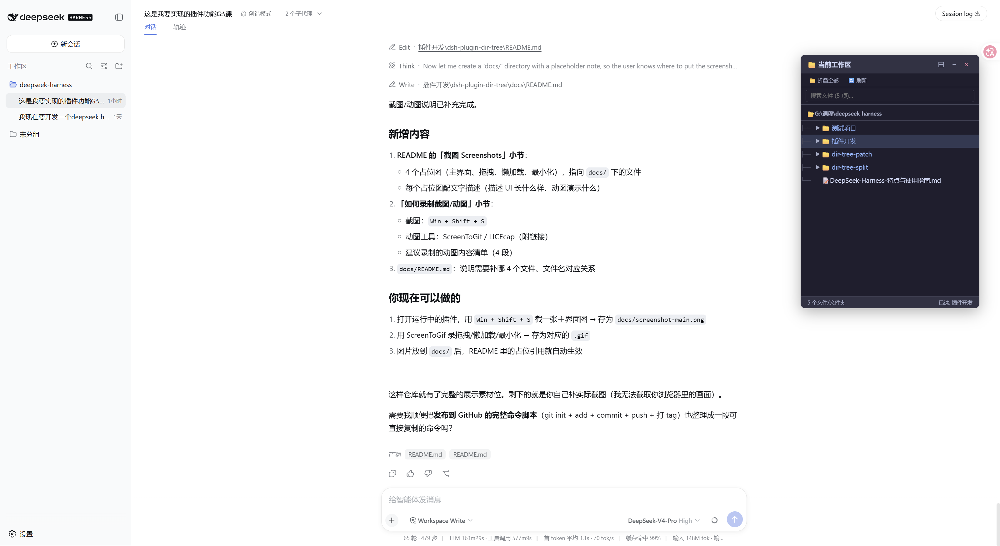
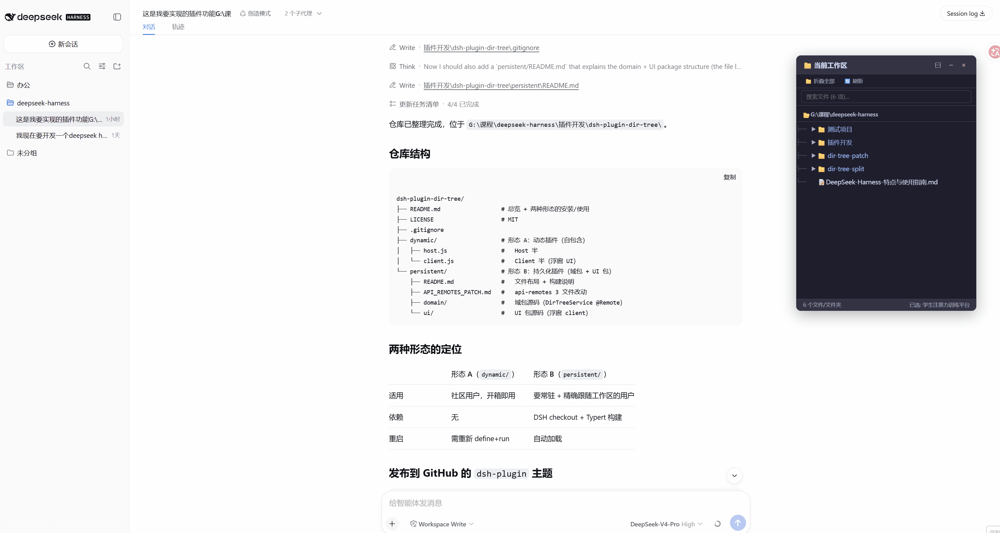
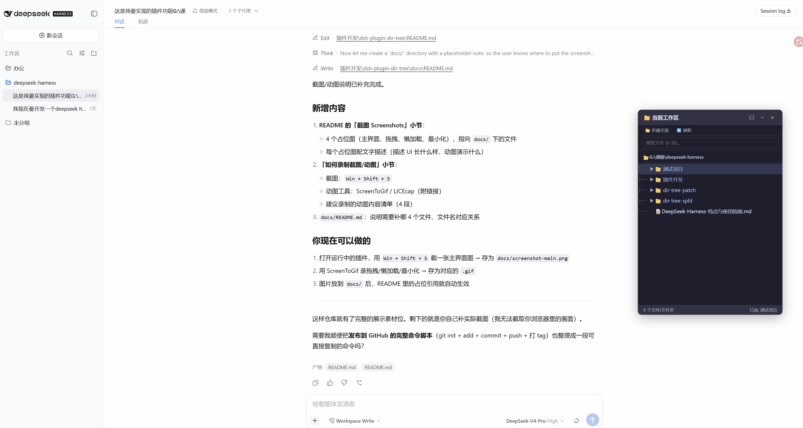
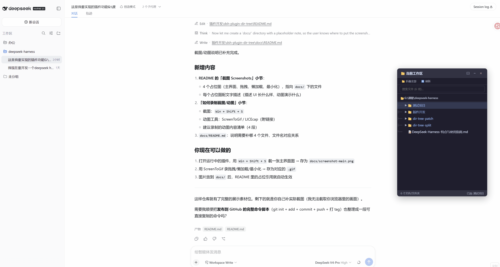

# dsh-plugin-dir-tree

> DeepSeek Harness (DSH) 插件：以浮窗展示**当前工作区**的目录树，支持**拖拽**文件/文件夹路径到对话框、双击复制、搜索过滤、懒加载展开。

A floating workspace **directory-tree** plugin for DeepSeek Harness (DSH), with drag-and-drop paths, double-click copy, search, and lazy-loading.

> 🚀 **想直接安装？用独立分发版**：[dsh-dir-tree](https://github.com/bentong-chain/dsh-dir-tree)（形态 C 标准 bundle，`dsh plugin add` 即装）

## 功能 Features

- 📁 浮窗展示工作区目录树，右下角可最小化
- 🌲 懒加载：点击 `▶` 展开子目录，避免大目录卡死
- 🖱️ 拖拽文件/文件夹到对话框，自动填入完整路径
- 📋 双击复制路径；单击选中
- 🔍 搜索过滤文件名
- 🎨 文件类型图标 + 目录 📁/📂 蓝色高亮 + 缩进树形线
- 🪟 可拖动浮窗位置

## 截图 Screenshots

### 主界面（浮窗 + 目录树）



右下角浮窗「📁 当前工作区」，顶部是完整路径，下面是树形目录：文件夹蓝色 + `📁` 图标 + `▶` 展开箭头，文件带类型图标。

### 拖拽路径到对话框（动图）



拖拽任意文件/文件夹节点到对话框输入框，自动填入完整路径。

### 懒加载展开（动图）



点击文件夹的 `▶` 展开子目录，只加载当前层，大目录不卡顿。

### 最小化 / 恢复



点 `−` 或 `×` 后浮窗收起，右下角出现蓝色「📁 目录树」按钮，点击恢复。

---

## 三种形态 Three Forms

本仓库提供三种形态，按需选用：

| 形态 | 说明 | 优点 | 缺点 |
|------|------|------|------|
| **C 标准 bundle**（`bundle/`）⭐ 推荐 | 单包 npm，`dsh plugin add` 即装 | 标准分发，无需 checkout/构建/创造模式 | 需发布到 npm 或 git |
| **A 动态插件**（`dynamic/`） | 自包含 JS 代码 | 开箱即用 | 重启后需重新运行 + 需创造模式 |
| **B 持久化插件**（`persistent/`） | 域包 + UI 包源码 | 重启自动加载 | 需在 DSH 源码 checkout 里改 api-remotes + 构建 |

### ⚠️ 先看你的 DSH 是怎么装的

| 安装方式 | 该用哪种形态 |
|---------|-------------|
| `npx @deepseek-ai/dsh web`（npm 安装） | **形态 C**（推荐）或形态 A |
| 源码 checkout（`git clone` + 自己跑） | 形态 C / A / B 都可以 |

**为什么推荐形态 C？**

形态 C 是 DSH 官方的**标准第三方插件分发方式**——一个 npm「组合包 bundle」，用户 `dsh plugin add` 安装即可，**无需源码 checkout、无需改内置包、无需创造模式**。它用 `ctx.connection.rpc`（第三方可用的 Client→Host 通道）替代了形态 B 里一等公民专属的 `@Remote`/api-remotes。

**形态 B 为什么被降级**：它用了 `@Remote` + api-remotes 的一等公民机制，需要修改 DSH 内置的 `api-remotes` 去挂载贡献，第三方插件改不了，所以只能作为「合入 monorepo 的内置插件」参考，不适合社区分发。

---

## 形态 C：标准 bundle（⭐ 推荐）

DSH 官方的**标准第三方插件分发方式**：一个 npm 包（组合包 bundle），用户 `dsh plugin add` 安装即可，**无需源码 checkout、无需改内置包、无需创造模式**。

> 🚀 **本形态已独立分发**：[dsh-dir-tree](https://github.com/bentong-chain/dsh-dir-tree)（含截图/文档/安装说明），一条命令即装：
>
> ```sh
> dsh plugin --profile web add github:bentong-chain/dsh-dir-tree
> ```

### 原理

- Host 半用 `ctx.connection.rpc.handle('/dirtree', ...)` 注册一条**第三方 RPC 通道**（不依赖 api-remotes、不依赖 Typert 代码生成）
- Client 半用 `ctx.connection.rpc.call('/dirtree', 'list', { path: cwd })` 调用 Host
- 当前工作区 `cwd` 由 Client 半从 `ctx.sessions.list.getSnapshot().byId[current].cwd` 拿到，直接传给 Host（无需在 Host 解析会话身份）

### 文件结构（`bundle/`）

```
bundle/
├── package.json       # dsh.bundle + dsh.client + prepare 构建脚本
├── cordis.patch.yml   # 插入插件行
├── index.js           # Host 半（connection.rpc.handle + node:fs 列目录）
├── client.js          # Client 半源码（浮窗 UI + connection.rpc.call）
├── client.bundle.js   # 构建产物（prepare 生成）
└── build.mjs          # prepare 脚本：esbuild 打包 client.js
```

### 安装

**方式一：从 git 安装（无需发布 npm）**

```sh
dsh plugin add github:你的用户名/dsh-plugin-dir-tree
```

首次会提示在 profile 的 `pnpm-workspace.yaml` 加 `allowBuilds` 授权，按提示复制粘贴即可。

**方式二：发布到 npm**

```sh
npm publish          # 作者先构建并发布
# 用户安装
dsh plugin add dsh-dir-tree
```

### 工作原理

1. Host 半注册 `/dirtree` RPC 通道，用 `node:fs` 的 `readdir({ withFileTypes: true })` 列目录
2. Client 半读当前会话 `cwd`，`connection.rpc.call('/dirtree', 'list', { path: cwd })` 拿目录
3. 浮窗渲染；点击 `▶` 懒加载时再 call 一次子目录

> 说明：本形态基于 DSH 源码调研，`connection.rpc` 的 API 已确认；`build.mjs` 的 esbuild 打包细节建议参照官方 `turtle-ui` 例子验证。会话身份不在 RPC 通道里，Client 半显式传 `cwd` 是最简单正确的做法。

---

## 形态 A：动态插件（最便携）

自包含代码，任何 DSH 用户都能直接使用，**无需 checkout、无需构建**。

### 前提

1. `cordis_define` / `cordis_run` 是 **DSH 的内置模型工具**，由对话里的 AI agent 调用（不是手动点按钮）。所以安装方式就是「把代码交给 agent」。
2. ⚠️ **这两个工具只有「创造模式」（Creator mode / `cordis` 预设）才提供**。`standard`（标准模式）、`code`（PTC 模式）、`minimal`（极简模式）预设里都没有，且**会话创建后预设固定，无法中途切换**。
3. 所以安装前请确认当前会话是「创造模式」；若不是，需**新建一个会话并选择「创造模式」**，再在新会话里安装。

> 如何确认/切换：打开 **设置（Settings）→ Agent 预设**，可看到当前预设；新建会话时选择「创造模式」（Creator mode / cordis）。运行中的会话保持它创建时的预设不变。

### 安装步骤

**方式一：直接粘贴代码（最通用）**

1. 打开 `dynamic/host.js` 和 `dynamic/client.js`，全选复制两个文件的内容。
2. 在 DSH 对话输入框里粘贴下面这段，并把两段代码填进去：

   ```
   请用 cordis_define + cordis_run 安装这个目录树动态插件：

   Host 代码（code.host）：
   <粘贴 dynamic/host.js 的全部内容>

   Client 代码（code.client）：
   <粘贴 dynamic/client.js 的全部内容>
   ```

3. 发送后，agent 会自动调用 `cordis_define`（把 host + client 一起提交，`idPrefix` 自动分配，如 `dirt`），再调用 `cordis_run` 激活。
4. 第一次激活客户端代码时会弹出**审批请求**，点 **允许 / Approve**。
5. 右下角出现「📁 当前工作区」浮窗，目录树加载完成。

**方式二：让 agent 读文件（仓库已 clone 到本地时）**

如果仓库已经 clone 到本地，直接对 agent 说：

```
读 dynamic/host.js 和 dynamic/client.js，用 cordis_define + cordis_run 装成动态插件
```

agent 会自己读文件、提交、运行，你无需手动复制粘贴。

### 使用

- 点击文件夹 `▶` 展开子目录（懒加载）
- 拖拽文件/文件夹到对话框，自动填入完整路径
- 双击复制路径；搜索框过滤文件名
- 点 `−` 或 `×` 最小化，右下角蓝色「📁 目录树」按钮恢复

### 注意与常见问题

- **重启 DSH 后需重新安装**（动态插件只存在进程内存里），重复上面的安装步骤即可。
- 动态插件展示的是 `workspaceRegistry` 的第一个工作区（最近创建的那个）；若要**精确跟随当前会话工作区**，用形态 B。

| 现象 | 原因 | 处理 |
|------|------|------|
| 卡在「⏳ 加载中」 | 远程调用失败但未报错 | 让 agent 用 `cordis_inspect_self` 看诊断 |
| 报「awaiting user approval」 | 等待审批 | 点允许 |
| 浮窗不见了 | 点到了 − 或 × | 点右下角蓝色「📁 目录树」按钮恢复 |
| 重启后没了 | 动态插件不持久化 | 重新安装，或改用形态 B |

---

## 形态 B：持久化插件（标准）

拆成两个包（对齐 DSH 官方 goal 的域包 + UI 包架构）：

- `@deepseek-ai/dsh-dir-tree`（**域包**，`persistent/domain/`）：Host `DirTreeService` + `@Remote` 服务，读 `agent.session.header.cwd` 精确取**当前会话工作区**
- `@deepseek-ai/dsh-client-ui-dir-tree`（**UI 包**，`persistent/ui/`）：客户端浮窗 UI
- api-remotes 挂载 `dirTreeRemote`（提供 `remote.dirTree` 命名空间）

### 前提

需要能访问 DSH 的源码 checkout（因为要编译 + Typert 代码生成）。

### 安装步骤

1. **放源码**：把 `persistent/domain/` 下的文件放到 DSH checkout 的 `packages/dir-tree/dir-tree/`，把 `persistent/ui/` 放到 `packages/client/ui-dir-tree/`。具体每个文件映射到哪个 `src/` 子目录，见 `persistent/README.md`。

2. **改 api-remotes**：按 `persistent/API_REMOTES_PATCH.md` 修改 `packages/api/remotes/` 的 3 个文件，挂载 `dirTreeRemote`。

3. **注册 tsconfig 引用**：
   - 根 `tsconfig.host.json` 的 `references` 加：`{ "path": "./packages/dir-tree/dir-tree/tsconfig.host.json" }`
   - 根 `tsconfig.client.json` 的 `references` 加：`{ "path": "./packages/client/ui-dir-tree" }`

4. **构建**：

   ```bash
   pnpm install
   pnpm run build:lib:host     # tsc -b + tsdown（含 typert 代码生成）
   pnpm run build:lib:client
   ```

5. **建包链接**（如果 DSH 的 `require.resolve` 找不到包，需要手动建 Junction/symlink）：

   ```
   apps/cli/node_modules/@deepseek-ai/dsh-dir-tree        → packages/dir-tree/dir-tree
   apps/cli/node_modules/@deepseek-ai/dsh-client-ui-dir-tree → packages/client/ui-dir-tree
   $DSH_HOME/profiles/node_modules/@deepseek-ai/...       → apps/cli/node_modules/@deepseek-ai/...
   ```

6. **注册到宿主组合**：编辑 `$DSH_HOME/profiles/<profile>/cordis.patch.yml`：

   ```yaml
   - insert:
       - id: dir-tree
         name: '@deepseek-ai/dsh-dir-tree'
       - id: ui-dir-tree
         name: '@deepseek-ai/dsh-client-ui-dir-tree'
   ```

7. **重启 DSH** → 右下角出现浮窗，切换工作区自动跟随。

### 为什么形态 B 能精确跟随工作区

域包的 `@Remote` 方法第一个参数是 `agent: Agent`（由网关从浏览器会话身份解析），用 `agent.session.header.cwd` 拿到**本会话**的工作区。每个会话各挂一份，切换工作区即切换到对应会话，目录树自动跟随。

### 注意

- 两个包当前是 `private: true`、版本 `0.1.0`；若要发布到 npm 或过 DSH 完整 release 门禁（`check-workspace-constraints` / `verify-package-invariants`），需对照 `packages/client/ui-goal` 补 `invariant` 伴生包、`publishConfig`、`repository`，并对齐版本号。

---

## 技术要点 Technical Notes

- **目录判断**：`FsDirEntry.isDirectory` 是 getter 且不可靠（`!!` 也可能失效），对每个条目调用 `fs.stat`/`fs.listDir` 会卡死。故采用**文件名启发式**（无 `.` → 目录）+ **懒加载**（只列一层，展开时再列子目录）。
- **JSON 安全**：文件节点不设 `children` 字段（`undefined` 不是合法 JSON），目录节点设 `children: []`。
- **形态 B 的 RPC**：`@Remote` Service + Typert 代码生成（生成 `typert.host.js` / `typert.remote-client.js`），客户端通过 `ctx.remote.dirTree.listTree(sessionId, {})` 调用。

## License

MIT
